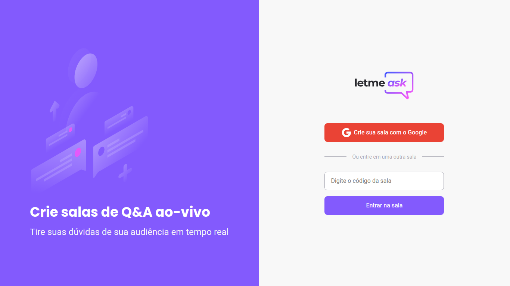

# Letmeask - Projeto da NLW#6 Together

<h1 align="center">
  
</h1>

  <a href="#-tecnologias">Tecnologias</a>&nbsp;&nbsp;&nbsp;|&nbsp;&nbsp;&nbsp;
  <a href="#-projeto">Projeto</a>&nbsp;&nbsp;&nbsp;|&nbsp;&nbsp;&nbsp;
  <a href="#-como-executar">Como executar</a>&nbsp;&nbsp;&nbsp;|&nbsp;&nbsp;&nbsp;

 

  

## ✨ Tecnologias

Esse projeto foi desenvolvido com as seguintes tecnologias:

- [React](https://reactjs.org)
- [TypeScript](https://www.typescriptlang.org/)
- [Firebase - Realtime Database](https://firebase.google.com/docs/database)
- [Firebase - Authentication](https://firebase.google.com/docs/auth)
- [Firebase - Hosting](https://firebase.google.com/docs/hosting)

## 💻 Projeto

O Letmeask é uma aplicação para criação de salas de Q&A, a fim de utilizar em ocasiões que é preciso uma maior organização para perguntar e responder questões.

## 🚀 Como executar

Esse projeto está hospedado [aqui](https://letmeask---nlw---together.web.app/), mas você também pode:

- Clonar o repositório
- Instalar as dependências com `yarn`ou com o `npm`
- Inicie o servidor com `yarn dev`ou `npm start`

Agora você pode acessar [`localhost:3000`](http://localhost:3000) do seu navegador.

